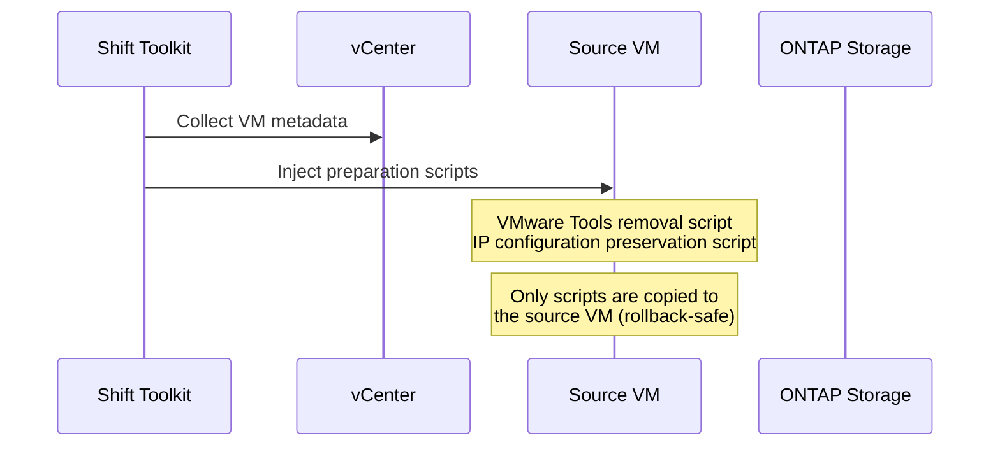
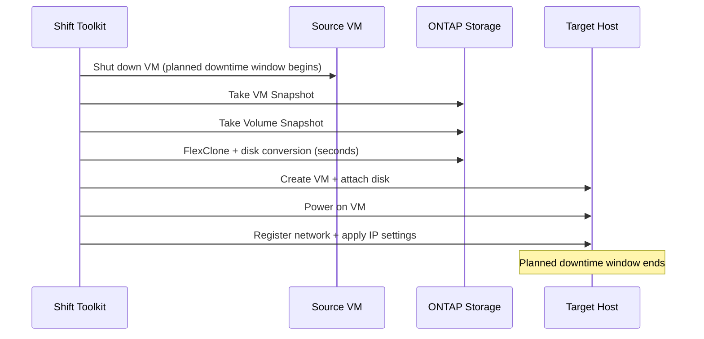

# What Is the Shift Toolkit — How FlexClone Changes the Game for VM Migration

<!-- dev.to front matter
---
title: "What Is the Shift Toolkit — How FlexClone Changes the Game for VM Migration"
published: false
description: "A deep dive into how NetApp Shift Toolkit works. Learn how ONTAP FlexClone enables disk conversions in seconds and transforms the VM migration experience."
tags: netapp, vmware, aws, ontap
series: "NetApp Shift Toolkit × VMware to EC2 / FSx for ONTAP"
---
-->

## Introduction

In the previous article, we explored the migration options available for VMware workloads and explained why "EC2 + FSx for ONTAP" is a compelling choice.

This time, we take a closer look at the internals of the **NetApp Shift Toolkit** — the core enabler of that migration path. In particular, we explain why "converting a 1TB VMDK takes only seconds," tracing the answer back to how FlexClone works.

## Challenges with Traditional VM Migration

Migrating a VM from VMware to another platform traditionally required the following process:

```text
Traditional migration flow:
1. Stop the source VM (or take a snapshot)
2. Export the VMDK
3. Convert VMDK to the target format (VHDX, QCOW2, RAW, etc.)
   └─ This is where a "full data copy" occurs (the bottleneck)
4. Transfer the converted disk to the target host
5. Create and boot the VM on the target
6. Apply network configuration
7. Remove VMware Tools / swap drivers
```

**The problem**: Step 3 — "disk conversion" — is the bottleneck. Reading an entire file byte-by-byte and writing it out in a different format is storage-I/O-bound and typically takes hours.

At scale, hours per VM × hundreds of VMs = weeks to months of project timeline.

## The Shift Toolkit Approach: "Conversion Without Copying"

The Shift Toolkit takes a fundamentally different approach. It **converts the disk format without copying the data**.

This is made possible by combining three ONTAP technologies.

### 1. Single Volume, Multi-Protocol Access

ONTAP allows a single volume (the equivalent of a NAS filesystem) to be accessed simultaneously via multiple protocols.

```text
ONTAP Volume: /vol/vm_data
├── NFS access: VMware ESXi stores VMDKs
├── SMB access: Hyper-V accesses VHDX files
└── iSCSI access: EC2 consumes the volume as a LUN
```

This eliminates the need to "copy data elsewhere before converting." The data stays physically in place — only the access method changes.

### 2. FlexClone: Zero-Copy Cloning

FlexClone is one of ONTAP's core technologies. It creates a **logical copy of a file or volume without physically copying any data blocks**.

```text
FlexClone operation:
                                    
  [Original VMDK]                   [Clone (post-conversion)]
  ┌──────────────┐                  ┌──────────────┐
  │ Block A      │◄── shared ──────►│ Block A      │
  │ Block B      │◄── shared ──────►│ Block B      │
  │ Block C      │◄── shared ──────►│ Block C      │
  └──────────────┘                  └──────────────┘
         │                                  │
         └── Physically the same blocks ────┘
             Additional capacity consumed: nearly zero
             Creation time: seconds (metadata operation only)
```

A normal file copy reads and writes every block. FlexClone **duplicates only the metadata (pointers)**. That is why cloning completes in seconds regardless of whether the file is 1TB or 10TB.

### 3. Combining FlexClone with VM Disk Conversion

The Shift Toolkit leverages FlexClone as follows:

1. **Clone the VMDK** (seconds)
2. **Rewrite the clone's metadata to convert it to the target format** (header-only rewrite)
3. **Expose the converted file to the target hypervisor**

Because the data blocks themselves are never copied, conversion speed is independent of disk size.

> NetApp's documentation states: "converting a 1TB VMDK file typically takes a couple of hours, but with the Shift toolkit, it can be completed in seconds." [(Source)](https://docs.netapp.com/us-en/netapp-solutions-virtualization/migration/shift-toolkit-overview.html)

## Shift Toolkit Migration Workflow

The Shift Toolkit is a GUI-based tool that automates the following steps.

### Phase 1: Prepare



### Phase 2: Migrate



**Key point**: The planned downtime window spans only from VM shutdown to target boot. Because the FlexClone conversion itself takes seconds, the bulk of downtime is consumed by the VM shutdown/startup process.

### Phase 3: Post-Processing

- VMware Tools removal
- Network configuration (IP preservation)
- Trigger scripts or cron jobs for automated settings

## Prerequisites and Constraints

Using the Shift Toolkit requires the following:

| Requirement | Details |
|-------------|---------|
| **Storage** | ONTAP 9.14.1 or later, NFS datastore |
| **Source hypervisor** | VMware vSphere 7.0.3 or later |
| **Tool runtime** | Windows Server (GUI application) |
| **Network** | HTTPS (443) reachable to vCenter/ESXi/ONTAP |
| **VM requirements** | VM must be hosted on an NFS datastore |

**Constraints:**

- VMs on SAN-based (iSCSI/FC) ONTAP storage must first be moved to an NFS datastore via Storage vMotion
- Windows-only tool (does not run on Linux/Mac)
- Recommended maximum of 10 concurrent conversions per source–destination pair
- EC2 support is in Early Preview (data disks only)

## Comparison with Other Tools: Why It Is Fast

| Aspect | Shift Toolkit | CMC | AWS MGN |
|--------|--------------|-----|---------|
| Data transfer method | FlexClone (no copy) | Block replication | Agent-based replication |
| 1TB conversion time | Seconds to minutes | Hours (bandwidth-dependent) | Hours (bandwidth-dependent) |
| Downtime | VM stop-to-start only | Near-zero (final sync only) | Cutover window only |
| Additional cost | Free | Paid (Marketplace) | Free |
| Prerequisites | ONTAP NFS datastore required | Agent installation | Agent installation |

The **speed advantage of the Shift Toolkit comes from "not moving data."** While most tools involve data copy or replication, the Shift Toolkit completes the conversion within ONTAP storage using metadata operations alone.

On the other hand, CMC and AWS MGN offer the ability to migrate while the source VM remains running — a strength suited to large-scale migrations with zero-downtime requirements. Neither approach is universally superior; the right choice depends on your requirements.

## Early Preview: Application to EC2 / FSx for ONTAP

In addition to the GA-supported targets (Hyper-V, OpenShift, Proxmox, OLVM), the Shift Toolkit has added **an Early Preview migration path to Amazon EC2 / Amazon FSx for NetApp ONTAP**.

Expected flow:

1. Shift Toolkit converts data-disk VMDKs via FlexClone
2. SnapMirror transfers the converted data to FSx for ONTAP
3. An EC2 instance mounts the data as an iSCSI LUN from FSx for ONTAP

> ⚠️ The detailed Early Preview workflow will be updated once NetApp publishes further documentation. The boot method for OS disks (AMI creation) is still under investigation.

## Summary

- The speed of the Shift Toolkit rests on **FlexClone (zero-copy cloning)**
- Because data is never physically moved, conversion speed is independent of disk size
- Prerequisite: an ONTAP NFS datastore is required
- The planned downtime window is reduced to roughly the VM stop/start duration
- EC2 / FSx for ONTAP support is in Early Preview; the detailed workflow will be confirmed through hands-on validation

In the next article, we will walk through building the validation environment (VPC + FSx for ONTAP + VPN) with a CloudFormation template.

---

## References

- [Shift Toolkit Overview](https://docs.netapp.com/us-en/netapp-solutions-virtualization/migration/shift-toolkit-overview.html)
- [Shift Toolkit Migration Workflow](https://docs.netapp.com/us-en/netapp-solutions-virtualization/migration/shift-toolkit-migration.html)
- [NetApp FlexClone Technology](https://docs.netapp.com/us-en/ontap/volumes/flexclone-efficient-copies-concept.html)
- [Tech ONTAP Blog: Effortless VM Migration](https://community.netapp.com/t5/Tech-ONTAP-Blogs/Effortless-VM-Migration-Hypervisor-hopping-with-instant-cloning-and-zero-data/ba-p/460596)

---

*This article is Part 2 of the NetApp Shift Toolkit Early Preview validation series.*
