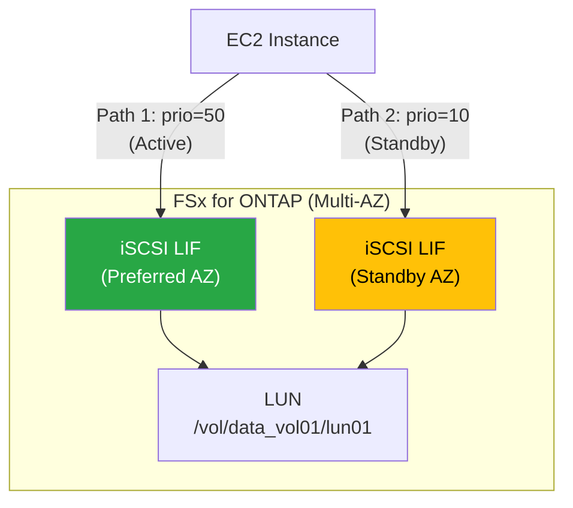

# アーキテクチャ図（Mermaid）

## 全体移行アーキテクチャ

```mermaid
graph LR
    subgraph OnPrem["オンプレミス"]
        vCenter["vCenter Server"]
        ESXi["ESXi Host"]
        ONTAP["ONTAP<br/>(NFS Datastore)"]
        ShiftTK["Shift Toolkit<br/>(Windows)"]
        VM_SRC["Source VM<br/>OS: VMDK<br/>Data: VMDK"]

        ESXi --> ONTAP
        VM_SRC --> ESXi
        ShiftTK --> vCenter
        ShiftTK --> ONTAP
    end

    subgraph AWS["AWS (ap-northeast-1)"]
        subgraph VPC["VPC"]
            EC2["EC2 Instance<br/>(Nitro/m5)"]
            EBS["EBS gp3<br/>(OS Disk)"]
            FSx for ONTAP["FSx for ONTAP<br/>(iSCSI LUN)"]
        end
        EC2 --> EBS
        EC2 -->|"iSCSI<br/>Multipath"| FSx for ONTAP
    end

    ONTAP -->|"SnapMirror"| FSx for ONTAP
    ShiftTK -->|"FlexClone<br/>Disk Conversion"| FSx for ONTAP
    VM_SRC -.->|"VM Import/Export<br/>(OS Disk)"| EBS

    style ShiftTK fill:#0067C5,color:#fff
    style FSx for ONTAP fill:#1D428A,color:#fff
    style ONTAP fill:#1D428A,color:#fff
```

## FSx for ONTAP iSCSI Multipath 構成



## 移行ジャーニー

```mermaid
graph TD
    VMware["VMware ESXi<br/>(現在地)"]

    VMware --> Phase1
    VMware --> EVS
    VMware --> NC2
    VMware --> ROSA

    subgraph Phase1["Phase 1: リホスト"]
        EC2_FSx for ONTAP["EC2 + FSx for ONTAP<br/>(iSCSI)"]
    end

    subgraph Phase2["Phase 2: リプラットフォーム"]
        ECS["ECS / EKS<br/>(EC2 mode)"]
        ECS_FSx for ONTAP["+ FSx for ONTAP (NFS/iSCSI)"]
        ECS --> ECS_FSx for ONTAP
    end

    subgraph Phase3["Phase 3: リファクタ"]
        Fargate["Fargate / Lambda"]
        S3_DDB["S3 / DynamoDB"]
        Fargate --> S3_DDB
    end

    Phase1 --> Phase2
    Phase2 --> Phase3

    EVS["Amazon EVS<br/>(VMware 継続)"]
    NC2["NC2 + ONTAP<br/>(Nutanix)"]
    ROSA["ROSA + FSx for ONTAP<br/>(OpenShift)"]

    style Phase1 fill:#e3f2fd
    style Phase2 fill:#f3e5f5
    style Phase3 fill:#e8f5e9
    style VMware fill:#ff9800,color:#fff
```

## ツール選択フローチャート

```mermaid
flowchart TD
    Start["VMware → EC2 移行を検討"]
    Q1{"ONTAP NFS<br/>データストア<br/>使用中?"}
    Q2{"FSx for ONTAP に<br/>データ配置<br/>したい?"}
    Q3{"移行規模は?"}

    MGN["AWS MGN<br/>(標準・無償)"]
    CMC["Cirrus Migrate Cloud<br/>(有償・大規模向け)"]
    Shift["Shift Toolkit<br/>(Early Preview・無償)"]
    BlueXP["BlueXP Migration Advisor<br/>(計画ツール)"] <!-- allow:naming -->

    Start --> Q1
    Q1 -->|No| MGN
    Q1 -->|Yes| Q2
    Q2 -->|No| MGN
    Q2 -->|Yes| Q3
    Q3 -->|"100+ VM"| CMC
    Q3 -->|"中小規模/PoC"| Shift

    Start -.->|"計画のみ"| BlueXP <!-- allow:naming -->

    style Shift fill:#0067C5,color:#fff
    style MGN fill:#FF9900,color:#000
    style CMC fill:#6c757d,color:#fff
```
