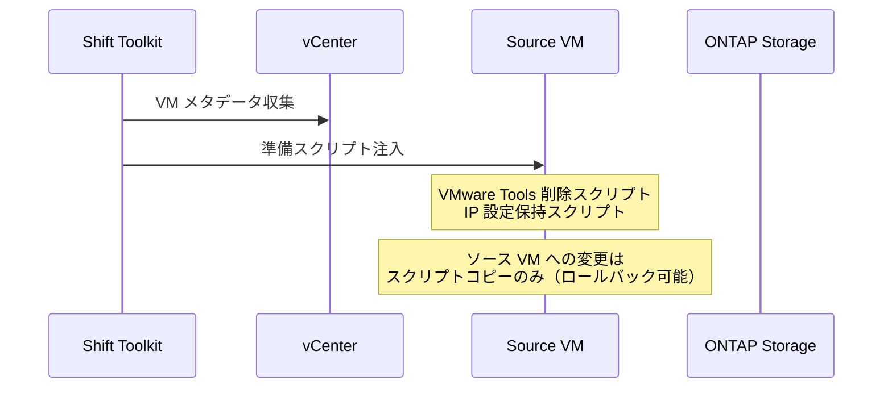
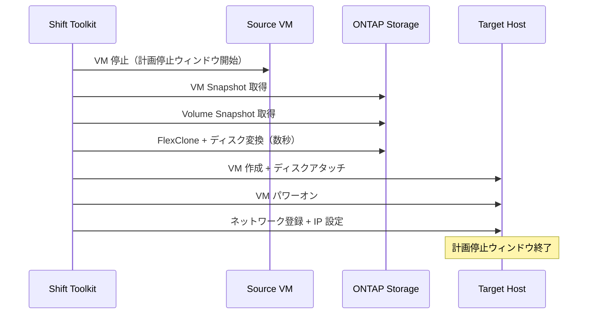

# Shift Toolkit とは何か — FlexClone が変える VM 移行の常識

<!-- dev.to front matter
---
title: "Shift Toolkit とは何か — FlexClone が変える VM 移行の常識"
published: false
description: "NetApp Shift Toolkit の仕組みを解説。ONTAP FlexClone による数秒でのディスク変換がVM移行をどう変えるかを整理します"
tags: netapp, vmware, aws, ontap
series: "NetApp Shift Toolkit × VMware to EC2 / FSx for ONTAP"
---
-->

## はじめに

前回の記事では、VMware 移行の選択肢を整理し、「EC2 + FSx for ONTAP」を選ぶ理由を説明しました。

今回は、その移行パスの中核を担う **NetApp Shift Toolkit** の仕組みに迫ります。特に、なぜ「1TB の VMDK 変換が数秒で終わる」と言えるのかを、FlexClone の動作原理から解説します。

## 従来の VM 移行の課題

VMware から別のプラットフォームへ VM を移行する場合、従来は以下のプロセスが必要でした:

```text
従来の移行フロー:
1. ソース VM を停止（またはスナップショット取得）
2. VMDK をエクスポート
3. VMDK → ターゲット形式に変換（VHDX, QCOW2, RAW 等）
   └─ ここで "データの完全コピー" が発生（ボトルネック）
4. 変換済みディスクをターゲットホストに転送
5. ターゲット側で VM を作成・起動
6. ネットワーク設定の適用
7. VMware Tools の削除・ドライバ差し替え
```

**問題**: Step 3 の「ディスク変換」がボトルネック。1TB のファイルをバイト単位で読み出し、別フォーマットで書き出す処理は、ストレージ I/O に依存して数時間かかる。

大規模移行では VM 1台あたり数時間 × 数百台 = 数週間〜数ヶ月のプロジェクト期間になります。

## Shift Toolkit の発想: 「変換しない変換」

Shift Toolkit のアプローチは根本的に異なります。**データをコピーせずにディスクフォーマットを変換する**のです。

これを可能にしているのが ONTAP の3つの技術の組み合わせです。

### 1. 単一ボリューム・マルチプロトコル

ONTAP では、1つのボリューム（NAS のファイルシステム相当）に対して、複数のプロトコルで同時にアクセスできます。

```text
ONTAP Volume: /vol/vm_data
├── NFS アクセス: VMware ESXi が VMDK を格納
├── SMB アクセス: Hyper-V が VHDX にアクセス
└── iSCSI アクセス: EC2 が LUN として利用
```

これにより、「データを別の場所にコピーしてから変換する」必要がなくなります。データは物理的に同じ場所にあり、アクセス方法だけが変わります。

### 2. FlexClone: ゼロコピーのクローン

FlexClone は ONTAP の核心技術の1つで、ファイルやボリュームの**論理的なコピーを物理データコピーなしで作成**します。

```text
FlexClone の動作:
                                    
  [オリジナル VMDK]                  [クローン（変換後）]
  ┌──────────────┐                  ┌──────────────┐
  │ Block A      │◄── 共有 ────────►│ Block A      │
  │ Block B      │◄── 共有 ────────►│ Block B      │
  │ Block C      │◄── 共有 ────────►│ Block C      │
  └──────────────┘                  └──────────────┘
         │                                  │
         └── 物理的には同じブロック ──────────┘
             追加容量消費: ほぼゼロ
             作成時間: 数秒（メタデータ操作のみ）
```

通常のファイルコピーは全ブロックを読み出して書き込みますが、FlexClone は**メタデータ（ポインタ）を複製するだけ**です。だから 1TB でも 10TB でもクローン作成は数秒で完了します。

### 3. VM ディスク変換との組み合わせ

Shift Toolkit は FlexClone を使って以下を実行します:

1. **VMDK のクローンを作成**（数秒）
2. **クローンのメタデータを書き換えてターゲット形式に変換**（ヘッダ部分のみの書き換え）
3. **変換後のファイルをターゲットハイパーバイザーに公開**

データブロック自体はコピーされないため、ディスクサイズに関係なく変換は高速です。

> NetApp のドキュメントでは「converting a 1TB VMDK file typically takes a couple of hours, but with the Shift toolkit, it can be completed in seconds」と記載されています。[（出典）](https://docs.netapp.com/us-en/netapp-solutions-virtualization/migration/shift-toolkit-overview.html)

## Shift Toolkit の移行ワークフロー

Shift Toolkit は GUI ベースのツールで、以下のステップを自動化します。

### Phase 1: 準備（Prepare）



### Phase 2: 移行実行（Migrate）



**ポイント**: 計画停止ウィンドウ（ダウンタイム）はVM停止〜ターゲット起動の間のみ。FlexClone 変換自体は数秒なので、ダウンタイムの大部分は VM のシャットダウン/起動プロセスです。

### Phase 3: 後処理

- VMware Tools の削除
- ネットワーク設定の適用（IP 維持）
- トリガースクリプトまたは cron ジョブによる自動設定

## 前提条件と制約

Shift Toolkit を使うには以下の条件が必要です:

| 要件 | 詳細 |
|------|------|
| **ストレージ** | ONTAP 9.14.1 以降、NFS データストア |
| **ソースハイパーバイザー** | VMware vSphere 7.0.3 以降 |
| **ツール動作環境** | Windows Server（GUI アプリケーション） |
| **ネットワーク** | HTTPS (443) でvCenter/ESXi/ONTAP に到達可能 |
| **VM 要件** | NFS データストア上にホストされていること |

**制約:**

- SAN（iSCSI/FC）ベースの ONTAP ストレージ上の VM は、事前に Storage vMotion で NFS データストアに移動が必要
- Windows 専用ツール（Linux/Mac では動作しない）
- 同時変換は同一ソース→デスティネーション間で最大10並列を推奨
- EC2 対応は Early Preview（データディスクのみ）

## 他のツールとの比較: なぜ速いのか

| 観点 | Shift Toolkit | CMC | AWS MGN |
|------|--------------|-----|---------|
| データ転送方式 | FlexClone（コピーなし） | ブロックレプリケーション | エージェントベースレプリケーション |
| 1TB 変換時間 | 数秒〜数分 | 数時間（帯域依存） | 数時間（帯域依存） |
| ダウンタイム | VM 停止〜起動の時間のみ | ほぼゼロ（最終同期のみ） | カットオーバー時のみ |
| 追加コスト | 無償 | 有償 (Marketplace) | 無償 |
| 前提条件 | ONTAP NFS データストア必須 | エージェントインストール | エージェントインストール |

Shift Toolkit の**速度の核心は「データを動かさない」こと**です。多くのツールがデータのコピー/レプリケーションを伴うのに対し、Shift Toolkit は ONTAP ストレージ内でメタデータ操作のみで変換を完了します。

一方で、CMC/MGN は「ソース VM を稼働させたまま移行できる」という強みがあり、ゼロダウンタイム要件のある大規模移行に適しています。どちらが上位ということではなく、要件に応じて使い分ける選択肢です。

## Early Preview: EC2 / FSx for ONTAP への応用

Shift Toolkit が GA でサポートするターゲット（Hyper-V, OpenShift, Proxmox, OLVM）に加え、**Early Preview として Amazon EC2 / FSx for ONTAP への移行パスが追加**されています。

想定フロー:

1. Shift Toolkit がデータディスク VMDK を FlexClone で変換
2. SnapMirror で変換済みデータを FSx for ONTAP に転送
3. EC2 インスタンスから FSx ONTAP の iSCSI LUN としてマウント

> ⚠️ Early Preview の具体的なワークフローは NetApp からのドキュメント公開後に更新予定。OS ディスクのブート方式（AMI 化）は別途確認中です。

## まとめ

- Shift Toolkit の速度の核心は **FlexClone（ゼロコピークローン）**
- データを物理的に動かさないため、ディスクサイズに依存しない変換速度を実現
- 前提: ONTAP NFS データストアが必須
- 計画停止ウィンドウは VM の停止/起動時間程度に抑えられる
- EC2/FSxN 対応は Early Preview。検証で具体的なワークフローを確認予定

次回は、検証環境の構築（VPC + FSx for ONTAP + VPN）を CloudFormation テンプレートで解説します。

---

## 参考リンク

- [Shift Toolkit Overview](https://docs.netapp.com/us-en/netapp-solutions-virtualization/migration/shift-toolkit-overview.html)
- [Shift Toolkit Migration Workflow](https://docs.netapp.com/us-en/netapp-solutions-virtualization/migration/shift-toolkit-migration.html)
- [NetApp FlexClone Technology](https://docs.netapp.com/us-en/ontap/volumes/flexclone-efficient-copies-concept.html)
- [Tech ONTAP Blog: Effortless VM Migration](https://community.netapp.com/t5/Tech-ONTAP-Blogs/Effortless-VM-Migration-Hypervisor-hopping-with-instant-cloning-and-zero-data/ba-p/460596)

---

*本記事は NetApp Shift Toolkit Early Preview の検証シリーズ第2回です。*
